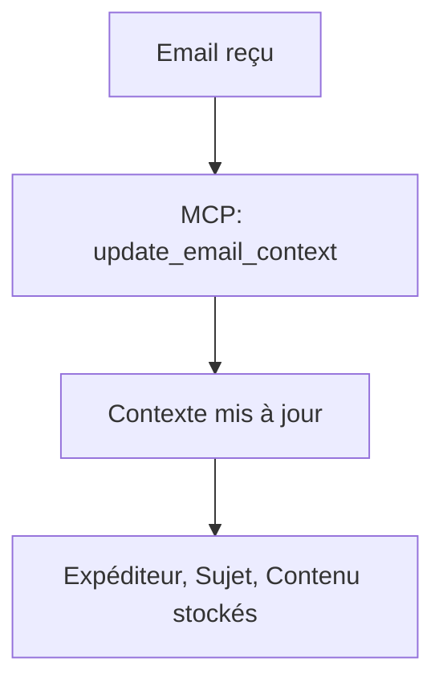
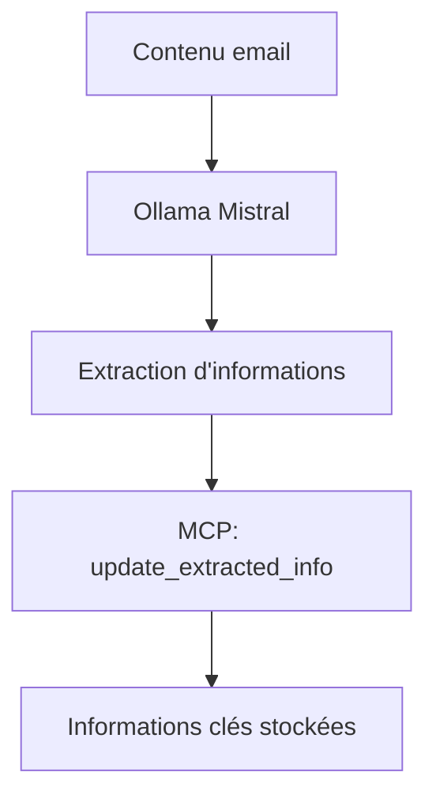
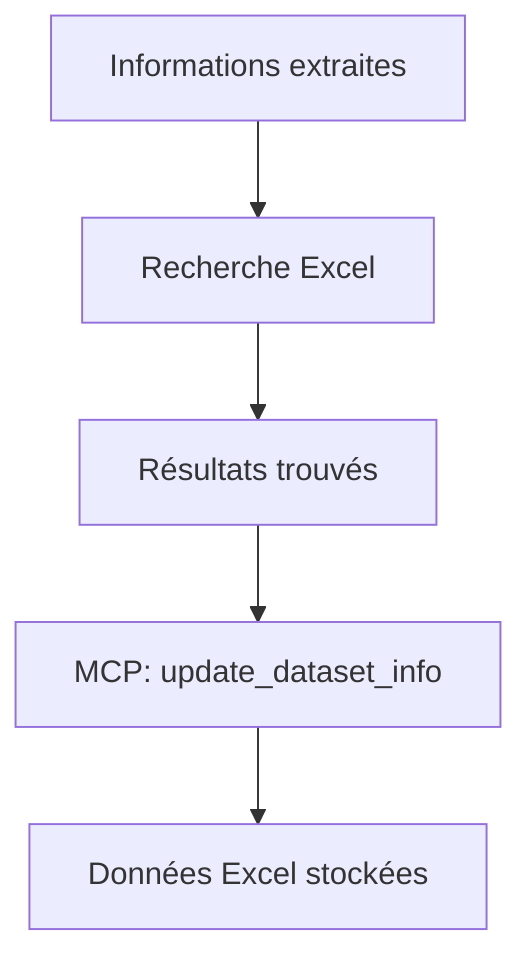
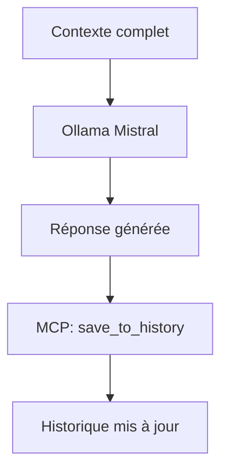

# Explication du Protocole MCP (Model Context Protocol) dans le Projet

## Qu'est-ce que le MCP ?

Le **Model Context Protocol (MCP)** est un protocole qui permet de gérer le contexte et les informations entre un modèle d'IA et les données externes. Dans notre projet, nous utilisons une implémentation simplifiée du MCP pour maintenir le contexte des emails et des données associées.

## Où le MCP est utilisé dans le code

### 1. **Fichier `mcp_manager.py`** - Le cœur du système MCP

```python
class MCPManager:
    def __init__(self):
        self.context = EmailContext(
            sender="",
            subject="",
            content="",
            extracted_info={},
            dataset_info={}
        )
        self.history: List[EmailContext] = []
```

**Structure du contexte :**
- `sender` : L'expéditeur de l'email
- `subject` : Le sujet de l'email
- `content` : Le contenu de l'email
- `extracted_info` : Informations extraites par l'IA
- `dataset_info` : Données trouvées dans Excel

### 2. **Fichier `email_agent.py`** - Utilisation du MCP

#### Initialisation du MCP Manager
```python
# Ligne 19
mcp_manager = MCPManager()
```

#### Utilisation dans `generate_response_with_ollama()`
```python
def generate_response_with_ollama(original_email, excel_data):
    """Génère une réponse avec Ollama Mistral en utilisant le MCP"""
    
    # 1. Mise à jour du contexte email
    mcp_manager.update_email_context(
        sender=original_email.from_,
        subject=original_email.subject,
        content=original_email.text
    )
    
    # 2. Extraction d'informations avec Ollama
    extracted_info = extract_information_with_ollama(original_email.text)
    mcp_manager.update_extracted_info(eval(extracted_info))
    
    # 3. Recherche dans Excel
    matching_data = search_in_excel(excel_data, extracted_info)
    mcp_manager.update_dataset_info(matching_data.to_dict('records'))
    
    # 4. Génération de la réponse
    response_content = generate_response(original_email.text)
    
    # 5. Sauvegarde dans l'historique
    mcp_manager.save_to_history()
    
    return response_content
```

## Processus détaillé du MCP

### Étape 1 : Réception d'un email


### Étape 2 : Extraction d'informations


### Étape 3 : Recherche dans la base de données


### Étape 4 : Génération de réponse


## Méthodes MCP disponibles

### 1. **update_email_context(sender, subject, content)**
```python
# Met à jour les informations de base de l'email
mcp_manager.update_email_context(
    sender="user@example.com",
    subject="Demande d'information",
    content="Bonjour, j'aimerais..."
)
```

### 2. **update_extracted_info(info)**
```python
# Met à jour les informations extraites par l'IA
extracted_info = {
    "question_principale": "Demande de contact",
    "mots_cles": ["contact", "information"],
    "contexte": "Client potentiel"
}
mcp_manager.update_extracted_info(extracted_info)
```

### 3. **update_dataset_info(info)**
```python
# Met à jour les données trouvées dans Excel
dataset_info = [
    {"nom": "Dupont", "telephone": "0123456789"},
    {"nom": "Martin", "telephone": "0987654321"}
]
mcp_manager.update_dataset_info(dataset_info)
```

### 4. **get_context_prompt()**
```python
# Génère un prompt complet avec tout le contexte
prompt = mcp_manager.get_context_prompt()
# Retourne un texte formaté avec toutes les informations
```

### 5. **save_to_history()**
```python
# Sauvegarde le contexte actuel dans l'historique
mcp_manager.save_to_history()
```

### 6. **clear_context()**
```python
# Réinitialise le contexte pour un nouvel email
mcp_manager.clear_context()
```

## Avantages du MCP dans ce projet

### 1. **Persistance du contexte**
- Les informations sont conservées pendant tout le processus
- Pas de perte de contexte entre les étapes

### 2. **Traçabilité**
- Historique complet des interactions
- Possibilité de revoir les décisions prises

### 3. **Modularité**
- Séparation claire des responsabilités
- Facile à étendre et modifier

### 4. **Debugging**
- Contexte complet disponible pour le débogage
- Logs détaillés des opérations

## Exemple concret d'utilisation

```python
# 1. Email reçu
email = {
    "from": "client@example.com",
    "subject": "Demande de contact",
    "text": "Bonjour, j'aimerais parler à quelqu'un de vos services."
}

# 2. MCP met à jour le contexte
mcp_manager.update_email_context(
    sender=email["from"],
    subject=email["subject"],
    content=email["text"]
)

# 3. Ollama extrait les informations
extracted = extract_information_with_ollama(email["text"])
# Résultat: {"question_principale": "Demande de contact", "mots_cles": ["contact", "services"]}

# 4. MCP stocke les informations extraites
mcp_manager.update_extracted_info(extracted)

# 5. Recherche dans Excel
results = search_in_excel(excel_data, extracted)
# Résultat: [{"nom": "Service Client", "telephone": "0123456789"}]

# 6. MCP stocke les données Excel
mcp_manager.update_dataset_info(results)

# 7. Génération de réponse avec tout le contexte
response = generate_response(email["text"])

# 8. Sauvegarde dans l'historique
mcp_manager.save_to_history()
```

## Flux de données complet

```
Email reçu
    ↓
MCP: update_email_context()
    ↓
Ollama: extract_information_with_ollama()
    ↓
MCP: update_extracted_info()
    ↓
Recherche: search_in_excel()
    ↓
MCP: update_dataset_info()
    ↓
Ollama: generate_response()
    ↓
MCP: save_to_history()
    ↓
Email envoyé
```

Cette architecture MCP permet une gestion robuste et traçable du contexte, facilitant le débogage et l'amélioration du système. 